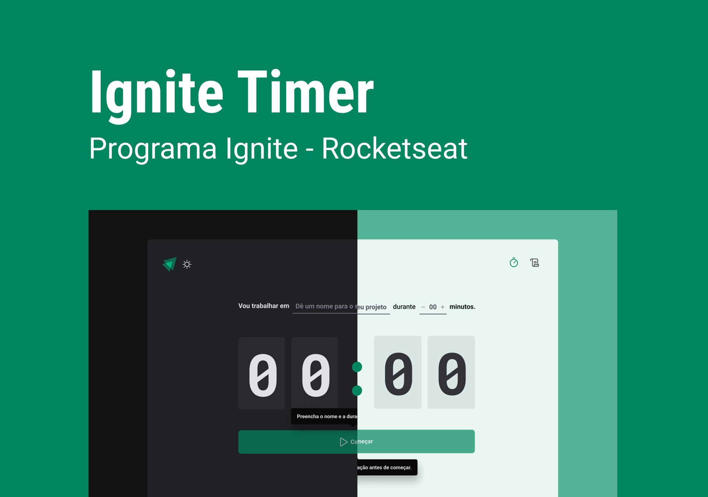
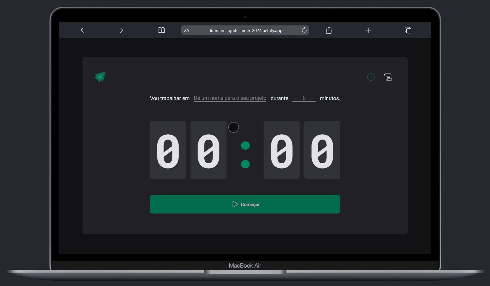
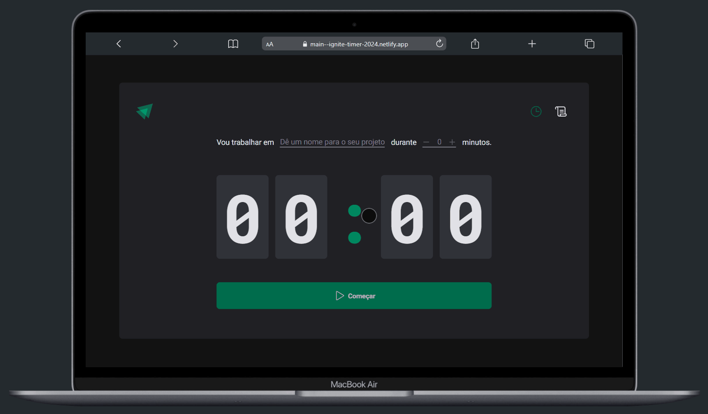

# ⏰ Ignite Timer

Um contador regressivo que organiza e monitora tarefas registradas, garantindo que você nunca perca um tempo!

<h1 align="center">
    
</h1>

## 📖 Sumário

- [Pré-Visualização](#clapper-pré-visualização)
- [Aviso](#loudspeaker-aviso)
- [Sobre](#memo-sobre)
- [Tecnologias](#floppy_disk-tecnologias)
- [Funcionalidades](#hammer-funcionalidades)
- [Autor](#nerd_face-autor)

</br>

## 🎬 Pré-Visualização

<h1 align="center">
  
</h1>

<h1 align="center">
  
</h1>

</br>

## 📢 Aviso

- O projeto **está finalizado**, mas poderá ter melhorias no futuro.

- Você pode testar a aplicação [clicando aqui!](https://main--ignite-timer-2024.netlify.app/)

- Você também pode clonar o repositório, e executar a aplicação localmente.

</br>

## 📝 Sobre

Este é um projeto do programa [Ignite da Rocketseat](https://www.rocketseat.com.br/formacao/react), aonde foi proposto a construção de um contador regressivo para gerenciar tarefas.
Alguns dos conceitos utilizados foram:
- Contextos
- Reducers
- Tipagens
- Imutabilidade

</br>

## 💾 Tecnologias

- **ReactJS** - utilizado para construir as interfaces;
- **TS** - usado para fazer toda a lógica da aplicação;
- **Styled Components** - utilizado para fazer a estilização;
- **React Hook Form** - para gerenciar o formulário;
- **Zod** - para organização de tipagens;
- **Git** - responsável por realizar o versionamento do código.
- **Vite** - usado para criar um projeto React;
- **Yarn** - utilizado para realizar a instalação das dependências;

</br>

## 🛠️ Funcionalidades

- [x] Iniciar uma tarefa;
- [x] Concluir uma tarefa;
- [x] Interromper uma tarefa;
- [x] Mostrar tarefas listadas;
- [x] Guardar tarefas na memória;

</br>

## 💡 Utilização

- Para utilizar esse projeto localmente, você deverá seguir os passos abaixo.

- Comece clonando o projeto:

```bash
  $git clone https://github.com/devgustavosantos/ignite-timer.git
```

- Entre no diretório:

```bash
  $cd ignite-timer
```

- Instale as dependências:

```bash
  $npm install
```

- Inicie um servidor local para o frontend:

```bash
  $npm run dev
```

- Se tudo der certo, você receberá uma mensagem parecida com essa:

```bash
  VITE v3.0.9  ready in 1989 ms

  ➜  Local:   http://127.0.0.1:5173/
  ➜  Network: use --host to expose
```

- Agora abra seu navegador no endereço que foi informado no "`Local`" para testar a aplicação.

---

_Esses são os recursos disponíveis nessa Aplicação, se algum recurso não funcionar como o esperado, verifique essa documentação e tente novamente._

_Caso persista, por favor,entre em contato com [devgustavosantos@outlook.com](mailto:devgustavosantos@outlook.com)._

## 🤓 Autor

Feito com ❤️ por Dev Gustavo Santos 😀 Veja meu [LinkedIn.](https://www.linkedin.com/in/devgustavosantos/)
